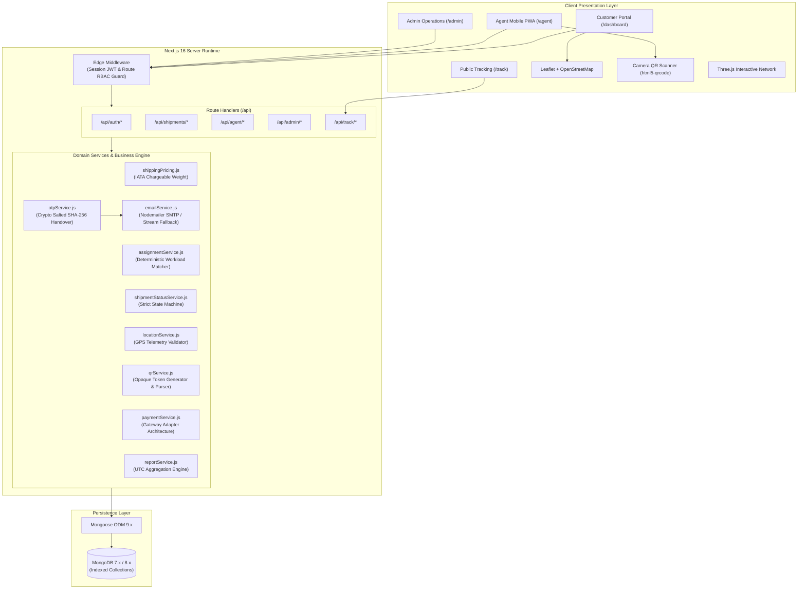
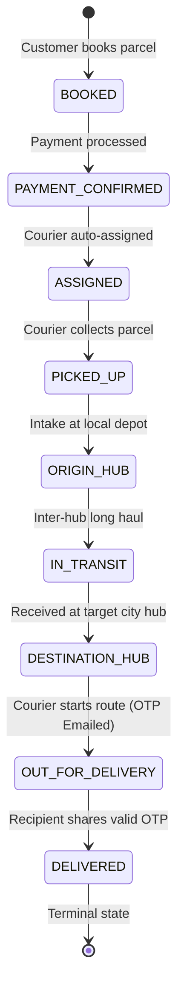

# 🚚 ShipShaft

### Smart Logistics & Courier Management System

[](https://nextjs.org/)
[](https://react.dev/)
[](https://www.mongodb.com/)
[](https://developer.mozilla.org/en-US/docs/Web/JavaScript)
[](https://tailwindcss.com/)
[](https://leafletjs.com/)
[](https://github.com/Akshaikp007/shipshaft)

**ShipShaft** is an end-to-end, production-grade logistics and parcel delivery platform built with **Next.js 16 (App Router)** and **MongoDB**. It coordinates the entire parcel lifecycle across three distinct operational personas: **Customers**, **Delivery Couriers**, and **Hub Operations / Administrators**.

The platform provides deterministic workload-balanced courier dispatch, authoritative server-side dimensional pricing, camera-driven QR parcel identification, tamper-proof SHA-256 email OTP delivery handovers, and real-time browser GPS courier telemetry rendered on interactive Leaflet maps.

---

## 📑 Table of Contents

- [Overview](#-overview)
- [System Architecture](#-system-architecture)
- [Core Features](#-core-features)
- [Shipment Lifecycle](#-shipment-lifecycle)
- [Role-Based Access Control](#-role-based-access-control)
- [Security Architecture](#-security-architecture)
- [Database Schema & Models](#-database-schema--models)
- [Tech Stack](#-tech-stack)
- [Project Structure](#-project-structure)
- [Installation & Setup](#-installation--setup)
- [Environment Variables](#-environment-variables)
- [Demo Credentials](#-demo-credentials)
- [API Reference](#-api-reference)
- [Test Suites](#-test-suites)
- [Future Roadmap](#-future-roadmap)
- [Author & License](#-author--license)

---

## 🌐 Overview

Modern supply chains suffer from visibility blackouts, manual dispatch bottlenecks, and handover disputes. ShipShaft was engineered to provide deterministic accountability from parcel intake to recipient doorstep.

```
       Intake & Quote               Hub & Courier Transit             Final Handover
┌──────────────────────────┐     ┌──────────────────────────┐     ┌─────────────────────┐
│ Customer Books Parcel    │ ──> │ Auto-Assigned Courier    │ ──> │ Salted OTP Handover │
│ IATA Chargeable Weight   │     │ Intermediate Hub Routing │     │ Live GPS Telemetry  │
│ Gateway-Ready Payment    │     │ QR Opaque Token Scans    │     │ Immutable Audit Log │
└──────────────────────────┘     └──────────────────────────┘     └─────────────────────┘
```

### Key Capabilities

- **Customer Self-Service**: Instant rate calculation with IATA volumetric weight formulas, payment simulation with itemized invoices, real-time tracking, and in-app notifications.
- **Courier Delivery Portal**: Mobile-responsive agent cockpit, camera-based QR scanner for package inspection, sequential lifecycle status progression, and live GPS beacon broadcasting.
- **Administrative Operations**: Fleet workload supervision, regional branch management, manual reassignment overrides, and multi-dimensional operational and financial reports.

---

## 🏛 System Architecture

The application follows a clean layered architecture with strict separation of concerns, decoupling presentation from business rules and data persistence.



---

## ⚡ Core Features

### 🔐 Authentication & Session Security
- **Stateless JWT Sessions**: Cryptographically signed sessions using [`jose`](https://github.com/panva/jose) with `HS256`, stored in secure `HTTP-only`, `SameSite=Lax` cookies.
- **Edge Route Protection**: Next.js Edge Middleware intercepts all route requests, verifying signatures and checking role permissions before rendering server components.
- **Bcrypt Password Hashing**: Passwords salted and hashed with `bcryptjs` (cost factor 10) prior to storage. Password hashes are excluded from Mongoose queries by default (`select: false`).
- **Granular Ownership Checks**: Server-side checks ensure customers can only query and pay for their own shipments, while delivery agents can only view and update shipments assigned directly to their profile.

### 📦 Authoritative Booking & Volumetric Pricing
- **IATA Standard Volumetric Weight**: Automatically calculates dimensional weight using the standard formula:
  $$\text{Volumetric Weight (kg)} = \frac{\text{Length (cm)} \times \text{Width (cm)} \times \text{Height (cm)}}{5000}$$
- **Chargeable Weight Billing**: Prices shipments based on $\max(\text{Actual Gross Weight}, \text{Volumetric Weight})$.
- **Tiered Logistics Multipliers**: Configurable tiers for *Standard Ground*, *Express Freight*, and *Priority Air Hub* with inter-city and international transit surcharges.
- **Collision-Resistant Tracking Identifiers**: Generates cryptographically secure tracking numbers formatted as `SHP-XXXXXXXX` with automated database deduplication.

### 💳 Payment Processing & Invoicing
- **Gateway Adapter Pattern**: Built on an extensible `PaymentProcessor` base class, allowing seamless plug-in of real payment gateways (Stripe, Razorpay) without altering shipment lifecycle code.
- **Simulated Payment Gateway**: Generates server-authoritative transaction IDs (`PAY-XXXXXXXX`) across simulated methods (`UPI`, `CARD`, `NET_BANKING`).
- **Atomic State Progression**: Payment confirmation automatically shifts parcel status from `BOOKED` to `PAYMENT_CONFIRMED` and triggers automated courier dispatch.
- **Automated Billing Records**: Generates unique tax-compliant invoice numbers (`INV-XXXXXXXX`) with itemized subtotal, tax calculations, and status records.

### 🤖 Deterministic Courier Dispatch
- **Zero AI / Zero Randomness**: Assignments are strictly deterministic and reproducible.
- **Candidate Eligibility Filtering**: Filters couriers attached to the parcel's destination branch who are currently `AVAILABLE`, active, and on-duty.
- **Workload Balancing**: Real-time aggregation calculates the active delivery count for every candidate. The courier with the lowest active delivery workload is awarded the shipment.
- **Predictable Tie-Breaking**: Ties are resolved lexicographically by `employeeId` (e.g., `AGT-BLR-001` before `AGT-BLR-002`), with a fallback to MongoDB ObjectId ordering.

### 📱 Opaque QR Parcel Scanning
- **High-Entropy Tokens**: Generates non-sequential, opaque QR codes formatted as `SHPQR-<32-hex-chars>`.
- **Read-Only Lookup**: Scanning a parcel allows couriers and handlers to inspect cargo details and route specs safely without triggering unintended state mutations.
- **Integrated Camera Scanner**: Mobile-friendly in-browser camera scanning powered by `html5-qrcode`, supporting both live video capture and manual code entry.
- **Deep Link & Payload Normalization**: Automatically normalizes prefixes (`SHIPSHAFT:SHPQR-...`), raw tokens, and tracking URLs.

### 🔑 Cryptographic Email OTP Handover
- **6-Digit Secure Code**: Generated via `crypto.randomInt(100000, 1000000)`—never using `Math.random()`.
- **Salted SHA-256 Storage**: The plaintext OTP is never persisted to the database. It is salted with the server secret, hashed via SHA-256, and stored with `select: false`.
- **Timing-Safe Verification**: Verifications employ `crypto.timingSafeEqual` over candidate hashes to thwart timing attacks.
- **Brute-Force & Replay Guards**: Capped at a maximum of 5 failed attempts. Expired or verified tokens are immediately purged, and repeated submissions return `400 Bad Request`.
- **Rate-Limited Resend**: Enforces a strict 60-second cooldown timer between OTP generation attempts.

### 📍 Real-Time Courier GPS Tracking
- **W3C Geolocation API**: Delivery couriers broadcast high-precision device telemetry (`latitude`, `longitude`, `accuracy`) from the mobile interface.
- **Restricted Telemetry Window**: GPS coordinate ingestion and public telemetry feeds are strictly enabled **only** while the shipment is in the `OUT_FOR_DELIVERY` state. GPS streams immediately shut down upon completion.
- **Interactive Leaflet Map**: Customer tracking views dynamically mount Leaflet with OpenStreetMap tiles, rendering live pulsing courier markers and location freshness indicators.
- **Stale Data Detection**: Highlights whether telemetry updates have been received within the last 60 seconds.

### 📊 Multi-Dimensional Admin Analytics
- **Overview Dashboard**: Aggregates total parcel counts, daily bookings, revenue figures, transit metrics, and active courier availability.
- **Multi-Filter UTC Aggregation**: Server-side date range filtering supporting `today`, `7d`, `30d`, `this_month`, and custom ISO spans.
- **Financial Breakdown**: Real-time revenue analytics separated by service tier, collected versus pending amounts, and payment methods.
- **Fleet & Hub Metrics**: Hub intake throughput, transit bottlenecks, individual courier delivery totals, and success rates.

---

## 🔄 Shipment Lifecycle

ShipShaft enforces a unidirectional **9-stage finite state machine**. Invalid state transitions or skipping intermediate checkpoints are strictly rejected server-side with `400 Bad Request`.



| Lifecycle Stage | Actor Permitted | Trigger & Requirements | Next Permitted State |
| :--- | :--- | :--- | :--- |
| **`BOOKED`** | Customer | Initial parcel registration and route calculation | `PAYMENT_CONFIRMED` |
| **`PAYMENT_CONFIRMED`** | Customer / System | Payment simulation succeeds; triggers dispatch check | `ASSIGNED` |
| **`ASSIGNED`** | System / Admin | Deterministic workload matcher assigns eligible courier | `PICKED_UP` |
| **`PICKED_UP`** | Assigned Courier | Courier collects package from sender premises | `ORIGIN_HUB` / `IN_TRANSIT` |
| **`ORIGIN_HUB`** | Hub Staff / Admin | Parcel sorted and checked in at departure terminal | `IN_TRANSIT` |
| **`IN_TRANSIT`** | Transit Operations | Parcel dispatched on line-haul transit network | `DESTINATION_HUB` |
| **`DESTINATION_HUB`**| Hub Staff / Courier | Parcel arrives at final destination sorting hub | `OUT_FOR_DELIVERY` |
| **`OUT_FOR_DELIVERY`**| Assigned Courier | Courier loads van; **dispatches 6-digit OTP to customer email** | `DELIVERED` *(via OTP only)* |
| **`DELIVERED`** | Assigned Courier | **Strict Requirement**: Valid recipient OTP entered via `/verify-otp` | *Terminal State* |

> [!IMPORTANT]
> Direct database or API mutation from `OUT_FOR_DELIVERY` to `DELIVERED` is programmatically blocked. Delivery completion strictly requires passing the customer's 6-digit OTP through the cryptographic verification pipeline.

---

## 👥 Role-Based Access Control

The application enforces three distinct role profiles defined in [`src/lib/constants/roles.js`](file:///c:/Users/aksha/Desktop/javascript/react/alltasks/shipshaft/src/lib/constants/roles.js):

| Capability / Resource | Customer | Delivery Agent | Operations Admin |
| :--- | :---: | :---: | :---: |
| **Public Parcel Tracking by Number** | ✅ | ✅ | ✅ |
| **Book New Parcel Shipment** | ✅ | ❌ | ✅ |
| **Process Payment & View Own Invoices** | ✅ | ❌ | ✅ |
| **View Shipment Details** | Own Shipments | Assigned Only | All Shipments |
| **QR Scan Parcel Identification** | ❌ | ✅ | ✅ |
| **Advance Shipment Status (Pickup/Hub)**| ❌ | Assigned Only | ✅ |
| **Verify Recipient Handover OTP** | ❌ | Assigned Only | ❌ |
| **Broadcast Live GPS Telemetry** | ❌ | Assigned Only | ❌ |
| **View Live Courier Map Telemetry** | Own Shipment | ❌ | ✅ |
| **Toggle Availability Status** | ❌ | ✅ | ❌ |
| **Manual Courier Assignment & Override**| ❌ | ❌ | ✅ |
| **Branch / Logistics Hub Management** | ❌ | ❌ | ✅ |
| **Fleet & Agent Management** | ❌ | ❌ | ✅ |
| **Operational & Financial Reports** | ❌ | ❌ | ✅ |

---

## 🛡 Security Architecture

- **HTTP-Only, SameSite Session Cookies**: Session tokens cannot be accessed or manipulated via client-side JavaScript (`document.cookie`), neutralizing cross-site scripting (XSS) session harvesting.
- **Zero Plaintext Credentials in DB**: User passwords are saved as bcrypt hashes; customer delivery OTPs are saved as salted SHA-256 hashes.
- **Timing-Safe Equality**: Hash comparisons for OTP handovers utilize `crypto.timingSafeEqual`, preventing side-channel attacks based on comparison duration.
- **Strict Server-Side Authorization**: Every API route handler derives the caller's identity strictly from the verified session JWT—never relying on client-supplied `userId` or `agentId` body fields.
- **IATA Calculation Integrity**: Shipment pricing is calculated authoritatively on the backend. Client submissions cannot manipulate shipping charges.
- **Restricted GPS Ingestion**: Coordinate ingestion APIs reject updates if the shipment is not `OUT_FOR_DELIVERY`, if the caller is not the assigned courier, or if the timestamps are in the future.

> [!WARNING]
> **Environment Protection**: Never commit `.env` or files containing database strings, mail passwords, or JWT secrets to source control. The repository includes strict `.gitignore` rules covering `.env`, `.env.local`, and `.env*.local`.

---

## 🗄 Database Schema & Models

Data is modeled using **Mongoose 9.x** with enforced validation constraints and compound indexes:

```
┌──────────────┐         ┌──────────────┐         ┌──────────────┐
│    Branch    │ 1     * │    Agent     │ 1     * │AgentLocation │
│ (City Hubs)  │────────>│ (Couriers)   │────────>│(GPS History) │
└──────────────┘         └──────────────┘         └──────────────┘
        │ 1                      │ 1                      │ *
        │                        │                        │
        │ *                      │ *                      │
┌──────────────┐ 1     * ┌──────────────┐ 1     * ┌──────────────┐
│     User     │────────>│   Shipment   │────────>│TrackingEvent │
│ (Auth/Roles) │         │ (Lifecycle)  │         │ (Audit Log)  │
└──────────────┘         └──────────────┘         └──────────────┘
        │ 1                      │ 1
        │                        │
        │ *                      │ 1
┌──────────────┐         ┌──────────────┐
│ Notification │         │Payment / Inv │
│ (Alert Feed) │         │ (Financials) │
└──────────────┘         └──────────────┘
```

### Core Entities

1. **`User`** ([`src/lib/models/User.js`](file:///c:/Users/aksha/Desktop/javascript/react/alltasks/shipshaft/src/lib/models/User.js)): Core authentication identity storing `name`, `email` (unique index), `phone`, `passwordHash` (`select: false`), `role` (`CUSTOMER`, `AGENT`, `ADMIN`), and `isActive`.
2. **`Branch`** ([`src/lib/models/Branch.js`](file:///c:/Users/aksha/Desktop/javascript/react/alltasks/shipshaft/src/lib/models/Branch.js)): Logistics sorting facilities and distribution depots storing `name`, `code` (e.g., `BLR-01`, unique index), `city`, `state`, `country`, and `managerId`.
3. **`Agent`** ([`src/lib/models/Agent.js`](file:///c:/Users/aksha/Desktop/javascript/react/alltasks/shipshaft/src/lib/models/Agent.js)): Courier profiles linking to a `User` record (`userId`), `employeeId` (unique), assigned `branchId`, `vehicleType`, `vehicleNumber`, and `availability` (`AVAILABLE`, `BUSY`, `OFFLINE`).
4. **`Shipment`** ([`src/lib/models/Shipment.js`](file:///c:/Users/aksha/Desktop/javascript/react/alltasks/shipshaft/src/lib/models/Shipment.js)): Central parcel entity containing `trackingNumber` (unique index), sender & recipient contact details, package dimensions, `weight`, `serviceType`, `shippingCost`, lifecycle `status`, `otpHash` (`select: false`), `otpExpiresAt`, `otpAttempts`, and `qrToken` (unique sparse index).
5. **`TrackingEvent`** ([`src/lib/models/TrackingEvent.js`](file:///c:/Users/aksha/Desktop/javascript/react/alltasks/shipshaft/src/lib/models/TrackingEvent.js)): Immutable chronological ledger tracking status updates, locations, hub references, and timestamps.
6. **`Payment`** ([`src/lib/models/Payment.js`](file:///c:/Users/aksha/Desktop/javascript/react/alltasks/shipshaft/src/lib/models/Payment.js)): Financial records tracking `shipmentId`, `amount`, `currency`, `method` (`UPI`, `CARD`, `NET_BANKING`), `status` (`PENDING`, `COMPLETED`, `FAILED`), and `transactionId`.
7. **`Invoice`** ([`src/lib/models/Invoice.js`](file:///c:/Users/aksha/Desktop/javascript/react/alltasks/shipshaft/src/lib/models/Invoice.js)): Formal billing document records storing `invoiceNumber` (unique index), `subtotal`, `tax`, `total`, and timestamp.
8. **`Notification`** ([`src/lib/models/Notification.js`](file:///c:/Users/aksha/Desktop/javascript/react/alltasks/shipshaft/src/lib/models/Notification.js)): User notification feed storing `recipientId`, `title`, `message`, `type`, and `read` status.
9. **`AgentLocation`** ([`src/lib/models/AgentLocation.js`](file:///c:/Users/aksha/Desktop/javascript/react/alltasks/shipshaft/src/lib/models/AgentLocation.js)): High-performance GPS telemetry time-series collection with compound indexes on `{ shipmentId: 1, recordedAt: -1 }` and `{ agentId: 1, recordedAt: -1 }`.

---

## 💻 Tech Stack

| Layer | Technology | Purpose |
| :--- | :--- | :--- |
| **Framework** | **Next.js 16.3.3** | Fullstack React framework utilizing modern App Router architecture |
| **Frontend Library** | **React 19.2.8** | Component architecture with Server and Client Components |
| **Styling** | **Tailwind CSS 4.0** | Utility-first CSS engine with centralized design tokens |
| **Database** | **MongoDB 7.x+** | Document database for flexible document storage and high-throughput telemetry |
| **ODM** | **Mongoose 9.9.4** | Schema enforcement, document validation, and population |
| **Session Security** | **jose 6.2.12** | Lightweight, Edge-compatible JSON Web Token signing and verification |
| **Password Hashing** | **bcryptjs 3.0.3** | Cryptographic salting and password hashing |
| **Maps & Telemetry** | **Leaflet 1.9.4** | Interactive mapping engine with OpenStreetMap tile layers |
| **QR Generation** | **qrcode 1.5.4** | Server-side QR matrix rendering for printable labels and UI |
| **QR Camera Scan** | **html5-qrcode 2.3.8** | Real-time cross-browser camera barcode and QR reading |
| **Mailing Service** | **nodemailer 10.0.13** | SMTP transport for OTP verification dispatch |
| **3D Visuals** | **Three.js 0.185.1** | Interactive 3D logistics node visualization on public homepage |
| **HTTP Client** | **axios 1.20.0** | Promise-based HTTP client for automated testing utilities |

---

## 📁 Project Structure

```text
shipshaft/
├── public/                          # Static assets, branding icons, and web manifests
├── scripts/                         # Maintenance, test scripts, and database seed utilities
│   ├── seed-hubs-agents.mjs         # Seeds operational hubs and delivery agents
│   ├── setup_e2e_phase9.mjs         # Test fixture setup script
│   └── test-otp-lifecycle.mjs       # OTP generation and delivery diagnostics
├── src/
│   ├── app/                         # Next.js App Router (pages and API routes)
│   │   ├── (auth)/                  # Authentication pages (login, register, reset)
│   │   ├── (customer)/              # Customer portal (dashboard, booking, tracking, invoices)
│   │   ├── (public)/                # Public homepage and open tracking search (/track)
│   │   ├── admin/                   # Operations Control Center (reports, users, fleet, hubs)
│   │   ├── agent/                   # Mobile courier portal (deliveries, QR scan, GPS tracker)
│   │   ├── api/                     # REST API endpoints
│   │   │   ├── admin/               # Admin management and analytical report handlers
│   │   │   ├── agent/               # Agent status, deliveries, and GPS ingestion handlers
│   │   │   ├── auth/                # Register, login, session, and logout handlers
│   │   │   ├── branches/            # Branch listing handlers
│   │   │   ├── invoices/            # Invoice retrieval endpoints
│   │   │   ├── notifications/       # User notification center endpoints
│   │   │   ├── payments/            # Payment execution and verification handlers
│   │   │   ├── shipments/           # Booking, OTP verification, and location telemetry
│   │   │   └── track/               # Public parcel tracking endpoint
│   │   ├── globals.css              # Global styles, Tailwind imports, and design variables
│   │   └── layout.js                # Root HTML document layout
│   ├── components/                  # Modular React UI component library
│   │   ├── admin/                   # Analytics charts, report widgets, and admin navigation
│   │   ├── agent/                   # Delivery cards, camera scanner, and GPS tracker
│   │   ├── auth/                    # Password strength indicator and login forms
│   │   ├── customer/                # Booking wizard, live Leaflet map, and payment checkout
│   │   ├── tracking/                # Timeline milestones and public tracking displays
│   │   ├── ui/                      # Atoms & primitives (Buttons, Modals, Badges, Tables, Toasts)
│   │   └── ThreeNetwork.jsx         # Three.js interactive logistics network canvas
│   ├── lib/                         # Core backend foundation, utilities, and services
│   │   ├── auth/                    # Session management (jose), passwords (bcrypt), RBAC guards
│   │   ├── constants/               # System enums (roles, shipment statuses, payment statuses)
│   │   ├── models/                  # Mongoose schemas (User, Shipment, Agent, Location, etc.)
│   │   ├── services/                # Business logic engines (pricing, dispatch, OTP, QR, GPS)
│   │   ├── utils/                   # Data formatters and validation helpers
│   │   └── db.js                    # Cached MongoDB connection manager
│   └── middleware.js                # Next.js Edge Middleware for JWT session & RBAC enforcement
├── tests/                           # Domain regression and subsystem verification suites
│   ├── test_phase5.mjs              # Simulated payment & invoicing tests
│   ├── test_phase6.mjs              # Courier assignment & state machine tests
│   ├── test_phase7.mjs              # QR token & scanner tests
│   ├── test_phase8.mjs              # Email OTP verification tests
│   ├── test_phase9.mjs              # GPS telemetry streaming tests
│   ├── test_phase10.mjs             # Admin analytics & reporting tests
│   ├── test_phase11.mjs             # End-to-end integration tests
│   └── test_tracking_consistency.mjs# Lifecycle consistency tests
├── .env.example                     # Environment configuration template
├── next.config.mjs                  # Next.js compilation configuration
├── package.json                     # Dependency manifests and run scripts
└── README.md                        # Project documentation
```

---

## 🚀 Installation & Setup

### Prerequisites

- **Node.js**: `v18.18.0` or `v20.x` or later
- **MongoDB**: Local MongoDB instance (`mongodb://localhost:27017`) or MongoDB Atlas URI
- **Git**

### 1. Clone the Repository

```bash
git clone https://github.com/Akshaikp007/shipshaft.git
cd shipshaft
```

### 2. Install Dependencies

```bash
npm install
```

### 3. Configure Environment Variables

Create your local `.env` configuration file from the template:

```bash
cp .env.example .env
```

Edit `.env` with your settings:

```env
MONGO_URI=mongodb://localhost:27017/shipshaft
JWT_SECRET=super_secure_jwt_secret_key_change_in_production
NODE_ENV=development

# SMTP Configuration (Required for live OTP email delivery)
SMTP_HOST=smtp.gmail.com
SMTP_PORT=587
SMTP_USER=your_email@gmail.com
SMTP_PASSWORD=your_google_app_password
SMTP_FROM="ShipShaft Logistics" <your_email@gmail.com>
```

> [!NOTE]
> If SMTP credentials are not configured, ShipShaft automatically falls back to an internal in-memory stream transport for local development and testing without throwing network errors.

### 4. Seed the Database

Populate default administrative accounts, regional sorting hubs, and delivery couriers:

```bash
node scripts/seed-hubs-agents.mjs
```

### 5. Launch the Development Server

```bash
npm run dev
```

Open [http://localhost:3000](http://localhost:3000) in your browser.

---

## 🔑 Demo Credentials

After running the seed script, you can log in using these default credentials:

| Role | Email Address | Password | Access Portal |
| :--- | :--- | :--- | :--- |
| **Operations Admin** | `admin@shipshaft.com` | `Admin@123456` | `/admin` |
| **Delivery Courier** | `agent@shipshaft.com` | `Agent@123456` | `/agent/dashboard` |
| **Delivery Courier (BLR)** | `agent.blr@shipshaft.com` | `Agent@123456` | `/agent/dashboard` |
| **Customer** | `customer@shipshaft.com` | `Customer@123456` | `/dashboard` |

*(New customer accounts can also be registered at any time via `/register`)*

---

## 📡 API Reference

### Authentication (`/api/auth`)

| Method | Endpoint | Access | Description |
| :--- | :--- | :--- | :--- |
| `POST` | `/api/auth/register` | Public | Register new customer account |
| `POST` | `/api/auth/login` | Public | Authenticate user & issue HTTP-only JWT cookie |
| `POST` | `/api/auth/logout` | Authenticated | Clear session cookie |
| `GET` | `/api/auth/session` | Authenticated | Retrieve current user profile |

### Shipments (`/api/shipments`)

| Method | Endpoint | Access | Description |
| :--- | :--- | :--- | :--- |
| `POST` | `/api/shipments` | Customer / Admin | Book shipment with server-side IATA quote |
| `GET` | `/api/shipments` | Customer / Admin | List user shipments with pagination |
| `GET` | `/api/shipments/:id` | Owner / Courier / Admin | Get detailed shipment data and history |
| `POST` | `/api/shipments/:id/payment` | Owner / Admin | Process payment & trigger auto-dispatch |
| `POST` | `/api/shipments/:id/verify-otp`| Assigned Courier | Complete delivery via 6-digit OTP verification |
| `POST` | `/api/shipments/:id/delivery-otp/resend` | Owner | Resend delivery OTP (60s cooldown) |
| `GET` | `/api/shipments/:id/location` | Owner / Courier / Admin | Fetch latest courier GPS coordinates |
| `GET` | `/api/shipments/:id/location/history`| Owner / Admin | Fetch chronological GPS breadcrumb trail |
| `GET` | `/api/shipments/qr/:token` | Courier / Admin | Resolve parcel details by opaque QR token |

### Public Tracking (`/api/track`)

| Method | Endpoint | Access | Description |
| :--- | :--- | :--- | :--- |
| `GET` | `/api/track/:trackingNumber` | Public | Public sanitized parcel timeline |

### Courier Operations (`/api/agent`)

| Method | Endpoint | Access | Description |
| :--- | :--- | :--- | :--- |
| `GET` | `/api/agent/deliveries` | Courier | List assigned active and completed parcels |
| `GET` | `/api/agent/deliveries/:id` | Courier | View single delivery manifest |
| `PATCH`| `/api/agent/deliveries/:id/status`| Courier | Advance status (`PICKED_UP`, `IN_TRANSIT`, etc.) |
| `POST` | `/api/agent/deliveries/:id/location` | Courier | Stream real-time GPS telemetry point |
| `PATCH`| `/api/agent/availability` | Courier | Toggle status (`AVAILABLE`, `BUSY`, `OFFLINE`) |

### Administration & Analytics (`/api/admin`)

| Method | Endpoint | Access | Description |
| :--- | :--- | :--- | :--- |
| `GET` | `/api/admin/users` | Admin | List all registered platform users |
| `GET` | `/api/admin/agents` | Admin | Courier fleet workload & status list |
| `POST` | `/api/admin/shipments/:id/assign` | Admin | Manually assign or override courier |
| `PATCH`| `/api/admin/shipments/:id/status` | Admin | Force advance parcel status |
| `GET` | `/api/admin/reports/overview` | Admin | Global operational KPI counters |
| `GET` | `/api/admin/reports/shipments`| Admin | Volume by state and SLA performance |
| `GET` | `/api/admin/reports/revenue` | Admin | Financial breakdown by service and method |
| `GET` | `/api/admin/reports/agents` | Admin | Courier delivery completion metrics |
| `GET` | `/api/admin/reports/branches` | Admin | Hub intake and distribution volume |
| `GET` | `/api/admin/reports/gps` | Admin | Active fleet real-time location map |

---

## 🧪 Test Suites

The repository contains isolated test suites verifying each domain subsystem against a live test database:

```bash
# Phase 5: Simulated Payment Processing, Invoicing & Auto-Assignment Trigger
node tests/test_phase5.mjs

# Phase 6: Delivery Agent Assignment, Workload Calculation & State Machine
node tests/test_phase6.mjs

# Phase 7: Opaque QR Token Generation, Deep Link Parsing & Scanner Validation
node tests/test_phase7.mjs

# Phase 8: Cryptographic Email OTP Verification, Salting & Handover
node tests/test_phase8.mjs

# Phase 9: Real-time GPS Telemetry Streaming & Access Controls
node tests/test_phase9.mjs

# Phase 10: Admin Reports, Multi-Dimension Aggregation & Operations Dashboard
node tests/test_phase10.mjs

# Phase 11: End-to-End System Integrity & Full Regression Suite
node tests/test_phase11.mjs
```

---

## 🔮 Future Roadmap

- [ ] **Live Payment Gateway**: Production adapter integration with Razorpay and Stripe webhooks.
- [ ] **SMS Gateway**: Real-time SMS OTP and delivery updates via Twilio / AWS SNS.
- [ ] **Automated Route Optimization**: Vehicle routing problem (VRP) algorithms to optimize multi-stop delivery routes.
- [ ] **Offline PWA Manifest**: Progressive Web App service worker caching for offline parcel scanning in low-reception depots.
- [ ] **Proof-of-Delivery Signatures**: Digital customer signature pad capture stored in S3/Cloud storage alongside OTP timestamps.

---

## 👨‍💻 Author & License

Developed with precision by **Akshaikp007**.

- **GitHub**: [@Akshaikp007](https://github.com/Akshaikp007)
- **Repository**: [https://github.com/Akshaikp007/shipshaft](https://github.com/Akshaikp007/shipshaft)

This project is licensed under the [MIT License](LICENSE).
